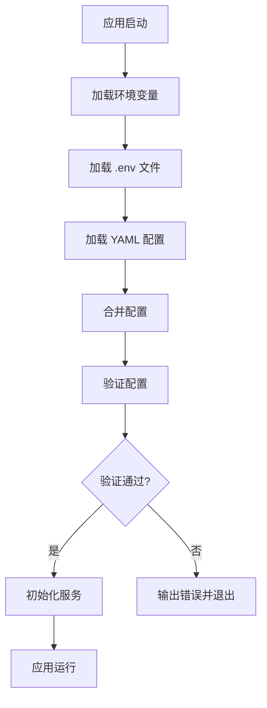

# 设计文档

## 概述

本设计旨在优化 SyntaxSeed 项目的环境变量管理系统，使其能够在 Docker 容器化环境中灵活配置数据库连接、JWT 安全参数、缓存设置等关键配置。设计将保持向后兼容性，同时提供更强的配置验证和错误处理机制。

## 架构

### 当前架构分析

当前项目已经具备了基础的环境变量支持：

- `server/config/env.js` 提供了环境变量配置管理
- `server/db.js` 中已有 `getDatabaseOverrides()` 机制
- `server/.env` 文件包含了基础配置
- `docker-compose.yml` 中有部分环境变量配置

### 目标架构

```
配置层次结构（优先级从高到低）：
1. 环境变量 (Docker/系统级)
2. .env 文件 (开发环境)
3. YAML 配置文件 (默认值)
4. 代码中的硬编码默认值
```

### 配置加载流程



## 组件和接口

### 1. 配置管理器 (ConfigManager)

**职责：** 统一管理所有配置的加载、合并、验证和访问

**接口：**

```javascript
class ConfigManager {
  // 加载所有配置源
  static loadConfig()

  // 获取特定配置
  static get(key)

  // 验证配置
  static validate()

  // 获取数据库配置
  static getDatabaseConfig()

  // 获取 Redis 配置
  static getRedisConfig()

  // 获取 JWT 配置
  static getJWTConfig()

  // 获取邮件配置
  static getMailConfig()
}
```

### 2. 配置验证器 (ConfigValidator)

**职责：** 验证配置的完整性和正确性

**接口：**

```javascript
class ConfigValidator {
  // 验证数据库配置
  static validateDatabase(config)

  // 验证 Redis 配置
  static validateRedis(config)

  // 验证 JWT 配置
  static validateJWT(config)

  // 验证邮件配置
  static validateMail(config)

  // 验证应用配置
  static validateApp(config)
}
```

### 3. 环境变量映射器 (EnvMapper)

**职责：** 将环境变量映射到内部配置结构

**接口：**

```javascript
class EnvMapper {
  // 映射数据库环境变量
  static mapDatabaseEnv()

  // 映射 Redis 环境变量
  static mapRedisEnv()

  // 映射 JWT 环境变量
  static mapJWTEnv()

  // 映射邮件环境变量
  static mapMailEnv()

  // 映射应用环境变量
  static mapAppEnv()
}
```

## 数据模型

### 环境变量定义

#### 数据库配置

```bash
# MySQL 数据库配置
DB_HOST=localhost           # 数据库主机地址
DB_PORT=3306               # 数据库端口
DB_USER=root               # 数据库用户名
DB_PASSWORD=password       # 数据库密码
DB_NAME=syntaxseed         # 数据库名称
DB_CHARSET=utf8mb4         # 字符集
DB_TIMEZONE=+08:00         # 时区

# 连接池配置
DB_POOL_MIN=2              # 最小连接数
DB_POOL_MAX=14             # 最大连接数
DB_POOL_ACQUIRE_TIMEOUT=30000    # 获取连接超时时间(ms)
DB_POOL_IDLE_TIMEOUT=30000       # 空闲连接超时时间(ms)
```

#### Redis 配置

```bash
# Redis 连接配置
REDIS_HOST=localhost       # Redis 主机地址
REDIS_PORT=6379           # Redis 端口
REDIS_PASSWORD=           # Redis 密码（可选）
REDIS_DB=0                # Redis 数据库编号
REDIS_PREFIX=syntax:      # Redis 键前缀
REDIS_CONNECT_TIMEOUT=10000     # 连接超时时间(ms)
REDIS_COMMAND_TIMEOUT=5000      # 命令超时时间(ms)
```

#### JWT 配置

```bash
# JWT 令牌配置
JWT_ACCESS_SECRET=your-access-secret      # 访问令牌密钥
JWT_ACCESS_EXPIRES_IN=300                 # 访问令牌过期时间(秒)
JWT_REFRESH_SECRET=your-refresh-secret    # 刷新令牌密钥
JWT_REFRESH_EXPIRES_IN=864000            # 刷新令牌过期时间(秒)
SESSION_SECRET=your-session-secret        # 会话密钥
```

#### 应用配置

```bash
# 应用基础配置
NODE_ENV=production        # 运行环境
PORT=7204                 # 服务端口
APP_NAME=SyntaxSeed       # 应用名称
APP_VERSION=1.0.0         # 应用版本

# 集群配置
CLUSTER_ENABLED=true      # 是否启用集群模式
CLUSTER_WORKERS=2         # 工作进程数量

# 限流配置
RATE_LIMIT_WINDOW_MS=900000      # 限流时间窗口(ms)
RATE_LIMIT_MAX_REQUESTS=1000     # 最大请求数

# 日志配置
LOG_LEVEL=info            # 日志级别
LOG_FILE_ENABLED=true     # 是否启用文件日志
LOG_FILE_PATH=./logs      # 日志文件路径
```

#### 邮件配置

```bash
# 邮件服务配置
MAIL_HOST=smtp.example.com     # SMTP 服务器地址
MAIL_PORT=587                  # SMTP 端口
MAIL_SECURE=false              # 是否使用 SSL/TLS
MAIL_USER=user@example.com     # 邮箱用户名
MAIL_PASS=password             # 邮箱密码
MAIL_FROM=SyntaxSeed <noreply@syntaxseed.com>  # 发件人地址
```

### 配置对象结构

```javascript
const config = {
  app: {
    name: string,
    version: string,
    env: 'development' | 'production' | 'test',
    port: number,
    cluster: {
      enabled: boolean,
      workers: number
    }
  },
  database: {
    client: string,
    connection: {
      host: string,
      port: number,
      user: string,
      password: string,
      database: string,
      charset: string,
      timezone: string
    },
    pool: {
      min: number,
      max: number,
      acquireTimeoutMillis: number,
      idleTimeoutMillis: number
    }
  },
  redis: {
    host: string,
    port: number,
    password?: string,
    db: number,
    keyPrefix: string,
    connectTimeout: number,
    commandTimeout: number
  },
  jwt: {
    access: {
      secret: string,
      expiresIn: number
    },
    refresh: {
      secret: string,
      expiresIn: number
    }
  },
  session: {
    secret: string
  },
  mail: {
    host: string,
    port: number,
    secure: boolean,
    auth: {
      user: string,
      pass: string
    },
    from: string
  },
  rateLimit: {
    windowMs: number,
    maxRequests: number
  },
  logging: {
    level: string,
    file: {
      enabled: boolean,
      path: string
    }
  }
}
```

## 错误处理

### 配置错误类型

1. **缺失必要配置**

   - 生产环境缺少 JWT 密钥
   - 数据库连接信息不完整
   - 邮件服务配置缺失

2. **配置格式错误**

   - 端口号不在有效范围内
   - 布尔值格式错误
   - 数字格式错误

3. **配置逻辑错误**
   - 连接池最小值大于最大值
   - 令牌过期时间设置不合理
   - 工作进程数量超出系统限制

### 错误处理策略

```javascript
// 配置错误处理
class ConfigError extends Error {
  constructor(message, field, value) {
    super(message);
    this.name = "ConfigError";
    this.field = field;
    this.value = value;
  }
}

// 错误处理流程
function handleConfigError(error) {
  console.error(`❌ 配置错误: ${error.message}`);
  if (error.field) {
    console.error(`   字段: ${error.field}`);
    console.error(`   值: ${error.value}`);
  }

  // 提供修复建议
  provideSuggestion(error.field);

  // 在生产环境中退出进程
  if (process.env.NODE_ENV === "production") {
    process.exit(1);
  }
}
```

## 测试策略

### 单元测试

1. **配置加载测试**

   - 测试环境变量优先级
   - 测试默认值回退机制
   - 测试配置合并逻辑

2. **配置验证测试**

   - 测试各种无效配置场景
   - 测试边界值处理
   - 测试必要字段验证

3. **环境变量映射测试**
   - 测试类型转换
   - 测试布尔值解析
   - 测试数组解析

### 集成测试

1. **数据库连接测试**

   - 测试不同数据库配置的连接
   - 测试连接池配置
   - 测试连接失败处理

2. **Redis 连接测试**

   - 测试 Redis 连接配置
   - 测试认证和数据库选择
   - 测试连接超时处理

3. **Docker 环境测试**
   - 测试 Docker Compose 环境变量传递
   - 测试容器间服务发现
   - 测试配置热更新

### 端到端测试

1. **完整部署测试**

   - 测试从零开始的 Docker 部署
   - 测试配置文件和环境变量的组合使用
   - 测试生产环境配置验证

2. **故障恢复测试**
   - 测试配置错误时的错误提示
   - 测试服务重启后的配置重载
   - 测试配置更新的影响范围

## 向后兼容性

### 兼容性保证

1. **现有配置文件支持**

   - 继续支持 `db.config.yaml`
   - 继续支持 `.env` 文件
   - 保持现有 API 接口不变

2. **渐进式迁移**

   - 新环境变量为可选项
   - 提供迁移指南和工具
   - 在弃用功能前提供充分警告

3. **配置验证增强**
   - 检测过时的配置项
   - 提供配置升级建议
   - 记录配置使用情况

### 迁移策略

```javascript
// 配置迁移检查
function checkLegacyConfig() {
  const warnings = [];

  // 检查过时的环境变量
  if (process.env.HEARD) {
    warnings.push("HEARD 已弃用，请使用 REDIS_PREFIX");
  }

  if (process.env.JWT_ACC_SECRET) {
    warnings.push("JWT_ACC_SECRET 已弃用，请使用 JWT_ACCESS_SECRET");
  }

  // 输出警告信息
  if (warnings.length > 0) {
    console.warn("⚠️  配置迁移警告:");
    warnings.forEach((warning) => console.warn(`  • ${warning}`));
  }
}
```
