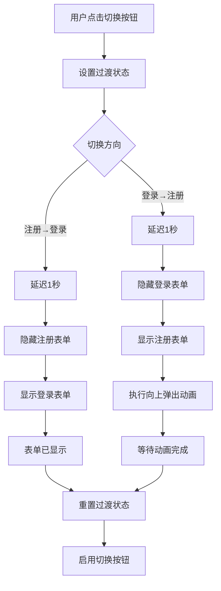

# 登录注册表单切换动画优化设计文档

## 概述

本设计文档描述了SyntaxSeed平台登录/注册表单切换动画优化的技术实现方案。该优化将解决当前动画不协调的问题，通过精确的时序控制和流畅的过渡效果，提供更好的用户体验。

## 架构

### 动画状态管理架构



### 组件状态设计

```typescript
interface AnimationState {
  // 主要状态控制
  isLogin: Ref<boolean>; // 当前是否为登录模式
  showRegister: Ref<boolean>; // 是否显示注册表单
  showLogin: Ref<boolean>; // 是否显示登录表单

  // 过渡状态控制
  registerTransitioning: Ref<boolean>; // 是否正在进行切换动画
  animationPhase: Ref<AnimationPhase>; // 当前动画阶段

  // 时序控制
  delayTimer: Ref<NodeJS.Timeout | null>; // 延迟定时器
  animationTimer: Ref<NodeJS.Timeout | null>; // 动画定时器
}

enum AnimationPhase {
  IDLE = "idle", // 空闲状态
  WAITING = "waiting", // 等待阶段（1秒延迟）
  HIDING = "hiding", // 隐藏当前表单
  SHOWING = "showing", // 显示目标表单
  ANIMATING = "animating", // 执行过渡动画
  COMPLETING = "completing", // 完成阶段
}
```

## 组件和接口

### 动画控制器设计

```typescript
class LoginAnimationController {
  private state: AnimationState;

  constructor(state: AnimationState) {
    this.state = state;
  }

  // 切换到注册模式
  async switchToRegister(): Promise<void> {
    if (this.state.registerTransitioning.value) return;

    this.state.registerTransitioning.value = true;
    this.state.animationPhase.value = AnimationPhase.WAITING;

    // 阶段1：等待1秒
    await this.delay(1000);

    // 阶段2：隐藏登录表单
    this.state.animationPhase.value = AnimationPhase.HIDING;
    this.state.showLogin.value = false;

    // 阶段3：显示注册表单
    this.state.animationPhase.value = AnimationPhase.SHOWING;
    this.state.showRegister.value = true;
    this.state.isLogin.value = true;

    // 阶段4：等待动画完成
    this.state.animationPhase.value = AnimationPhase.ANIMATING;
    await this.delay(600); // 动画持续时间

    // 阶段5：完成
    this.state.animationPhase.value = AnimationPhase.COMPLETING;
    await this.delay(100); // 缓冲时间

    this.state.animationPhase.value = AnimationPhase.IDLE;
    this.state.registerTransitioning.value = false;
  }

  // 切换到登录模式
  async switchToLogin(): Promise<void> {
    if (this.state.registerTransitioning.value) return;

    this.state.registerTransitioning.value = true;
    this.state.animationPhase.value = AnimationPhase.WAITING;

    // 阶段1：等待1秒
    await this.delay(1000);

    // 阶段2：隐藏注册表单（带动画）
    this.state.animationPhase.value = AnimationPhase.HIDING;
    this.state.showRegister.value = false;

    // 等待隐藏动画完成
    await this.delay(600);

    // 阶段3：显示登录表单
    this.state.animationPhase.value = AnimationPhase.SHOWING;
    this.state.showLogin.value = true;
    this.state.isLogin.value = false;

    // 阶段4：完成
    this.state.animationPhase.value = AnimationPhase.COMPLETING;
    await this.delay(100);

    this.state.animationPhase.value = AnimationPhase.IDLE;
    this.state.registerTransitioning.value = false;
  }

  private delay(ms: number): Promise<void> {
    return new Promise((resolve) => setTimeout(resolve, ms));
  }
}
```

### Vue组件集成接口

```typescript
// 在Login.vue中的集成方式
interface LoginComponentAnimation {
  // 状态管理
  animationController: LoginAnimationController;

  // 响应式状态
  showLogin: Ref<boolean>;
  showRegister: Ref<boolean>;
  animationPhase: Ref<AnimationPhase>;

  // 方法
  switchToRegister(): Promise<void>;
  switchToLogin(): Promise<void>;

  // 生命周期
  onMounted(): void;
  onUnmounted(): void;
}
```

## 数据模型

### 动画配置模型

```typescript
interface AnimationConfig {
  // 时序配置
  delayBeforeSwitch: number; // 切换前延迟时间（1000ms）
  animationDuration: number; // 动画持续时间（600ms）
  completionBuffer: number; // 完成缓冲时间（100ms）

  // 缓动函数配置
  easingFunction: string; // 'ease-in-out'

  // 响应式断点
  mobileBreakpoint: number; // 650px

  // 动画类型
  desktopAnimation: "slide-horizontal";
  mobileAnimation: "slide-vertical";
}

const defaultAnimationConfig: AnimationConfig = {
  delayBeforeSwitch: 1000,
  animationDuration: 600,
  completionBuffer: 100,
  easingFunction: "ease-in-out",
  mobileBreakpoint: 650,
  desktopAnimation: "slide-horizontal",
  mobileAnimation: "slide-vertical",
};
```

### 动画状态跟踪模型

```typescript
interface AnimationStateTracker {
  currentPhase: AnimationPhase;
  startTime: number;
  expectedEndTime: number;
  direction: "to-register" | "to-login";
  deviceType: "desktop" | "mobile";
}
```

## 错误处理

### 动画中断处理

```typescript
class AnimationErrorHandler {
  // 处理动画中断
  static handleAnimationInterrupt(
    controller: LoginAnimationController,
    reason: "user-action" | "component-unmount" | "error",
  ): void {
    // 清理所有定时器
    controller.clearAllTimers();

    // 重置状态
    controller.resetToStableState();

    // 记录中断原因
    console.warn(`Animation interrupted: ${reason}`);
  }

  // 处理性能问题
  static handlePerformanceIssue(): void {
    // 降级到简单动画
    console.warn(
      "Performance issue detected, falling back to simple animations",
    );
  }

  // 处理浏览器兼容性问题
  static handleCompatibilityIssue(): void {
    // 禁用复杂动画
    console.warn("Browser compatibility issue, disabling complex animations");
  }
}
```

### 错误恢复策略

1. **动画卡死恢复**: 设置最大动画时间限制，超时自动恢复
2. **状态不一致恢复**: 定期检查状态一致性，自动修正
3. **内存泄漏防护**: 组件卸载时强制清理所有定时器和监听器

## 测试策略

### 动画时序测试

```typescript
describe("Login Animation Timing", () => {
  test("should wait 1 second before switching to register", async () => {
    const startTime = Date.now();
    await animationController.switchToRegister();
    const endTime = Date.now();

    expect(endTime - startTime).toBeGreaterThanOrEqual(1600); // 1s delay + 0.6s animation
  });

  test("should complete animation within expected time", async () => {
    const startTime = Date.now();
    await animationController.switchToLogin();
    const endTime = Date.now();

    expect(endTime - startTime).toBeLessThan(2000); // Should not exceed 2 seconds
  });
});
```

### 响应式动画测试

```typescript
describe("Responsive Animation", () => {
  test("should use horizontal animation on desktop", () => {
    // Mock desktop viewport
    Object.defineProperty(window, "innerWidth", { value: 1024 });

    const animationType = getAnimationType();
    expect(animationType).toBe("slide-horizontal");
  });

  test("should use vertical animation on mobile", () => {
    // Mock mobile viewport
    Object.defineProperty(window, "innerWidth", { value: 375 });

    const animationType = getAnimationType();
    expect(animationType).toBe("slide-vertical");
  });
});
```

### 用户交互测试

```typescript
describe("User Interaction During Animation", () => {
  test("should disable buttons during animation", async () => {
    const switchPromise = animationController.switchToRegister();

    // Button should be disabled immediately
    expect(registerButton.disabled).toBe(true);

    await switchPromise;

    // Button should be enabled after animation
    expect(registerButton.disabled).toBe(false);
  });

  test("should ignore clicks during animation", async () => {
    const switchPromise = animationController.switchToRegister();

    // Try to switch back immediately
    const secondSwitchResult = await animationController.switchToLogin();

    // Second switch should be ignored
    expect(secondSwitchResult).toBe(false);

    await switchPromise;
  });
});
```

## 性能优化

### CSS动画优化

```scss
// 使用transform和opacity进行硬件加速
.form-transition {
  will-change: transform, opacity;
  transform: translateZ(0); // 强制硬件加速

  &.slide-enter-active,
  &.slide-leave-active {
    transition:
      transform 0.6s ease-in-out,
      opacity 0.6s ease-in-out;
  }

  // 桌面端水平滑动
  @media screen and (min-width: 651px) {
    &.slide-enter-from {
      transform: translateX(100%) translateZ(0);
      opacity: 0;
    }

    &.slide-leave-to {
      transform: translateX(-100%) translateZ(0);
      opacity: 0;
    }
  }

  // 移动端垂直滑动
  @media screen and (max-width: 650px) {
    &.slide-enter-from {
      transform: translateY(100%) translateZ(0);
      opacity: 0;
    }

    &.slide-leave-to {
      transform: translateY(-100%) translateZ(0);
      opacity: 0;
    }
  }
}
```

### JavaScript性能优化

```typescript
// 使用requestAnimationFrame优化动画
class OptimizedAnimationController {
  private rafId: number | null = null;

  private animateWithRAF(callback: () => void): void {
    this.rafId = requestAnimationFrame(() => {
      callback();
      this.rafId = null;
    });
  }

  private cancelRAF(): void {
    if (this.rafId) {
      cancelAnimationFrame(this.rafId);
      this.rafId = null;
    }
  }

  // 清理资源
  cleanup(): void {
    this.cancelRAF();
    this.clearAllTimers();
  }
}
```

### 内存管理优化

```typescript
// 自动清理机制
class AnimationMemoryManager {
  private timers: Set<NodeJS.Timeout> = new Set();
  private rafIds: Set<number> = new Set();

  addTimer(timer: NodeJS.Timeout): void {
    this.timers.add(timer);
  }

  addRAF(rafId: number): void {
    this.rafIds.add(rafId);
  }

  cleanup(): void {
    // 清理所有定时器
    this.timers.forEach((timer) => clearTimeout(timer));
    this.timers.clear();

    // 清理所有RAF
    this.rafIds.forEach((rafId) => cancelAnimationFrame(rafId));
    this.rafIds.clear();
  }
}
```

## 安全考虑

### 防止动画攻击

1. **频率限制**: 限制用户在短时间内的切换次数
2. **资源保护**: 防止恶意触发大量动画消耗系统资源
3. **状态验证**: 确保动画状态的合法性

### 可访问性支持

```typescript
// 支持用户的动画偏好设置
const respectsReducedMotion = (): boolean => {
  return window.matchMedia("(prefers-reduced-motion: reduce)").matches;
};

// 为有动画敏感的用户提供简化版本
const getAnimationConfig = (): AnimationConfig => {
  if (respectsReducedMotion()) {
    return {
      ...defaultAnimationConfig,
      animationDuration: 0,
      delayBeforeSwitch: 0,
    };
  }
  return defaultAnimationConfig;
};
```

## 部署考虑

### 浏览器兼容性

- **现代浏览器**: 使用完整的CSS Transform和Transition
- **旧版浏览器**: 降级到简单的显示/隐藏切换
- **移动浏览器**: 优化触摸设备的动画性能

### 性能监控

```typescript
// 动画性能监控
class AnimationPerformanceMonitor {
  static measureAnimationPerformance(
    animationName: string,
    startTime: number,
    endTime: number,
  ): void {
    const duration = endTime - startTime;

    // 记录性能数据
    console.log(`Animation ${animationName} took ${duration}ms`);

    // 如果动画时间过长，发出警告
    if (duration > 2000) {
      console.warn(
        `Animation ${animationName} is taking too long: ${duration}ms`,
      );
    }
  }
}
```

### 调试支持

```typescript
// 开发环境下的动画调试工具
const AnimationDebugger = {
  logStateChange(from: AnimationPhase, to: AnimationPhase): void {
    if (process.env.NODE_ENV === "development") {
      console.log(`Animation phase: ${from} -> ${to}`);
    }
  },

  visualizeAnimationBounds(): void {
    if (process.env.NODE_ENV === "development") {
      // 在开发环境中显示动画边界
      document.querySelectorAll(".form-box").forEach((el) => {
        el.style.outline = "2px dashed red";
      });
    }
  },
};
```
