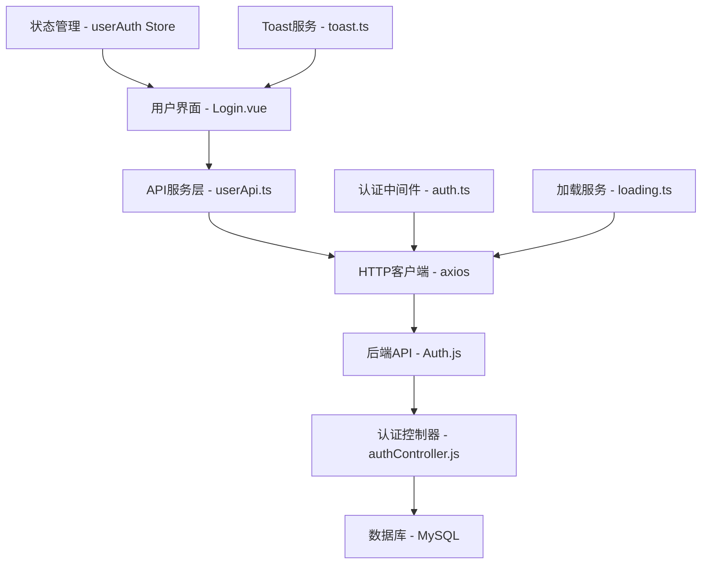
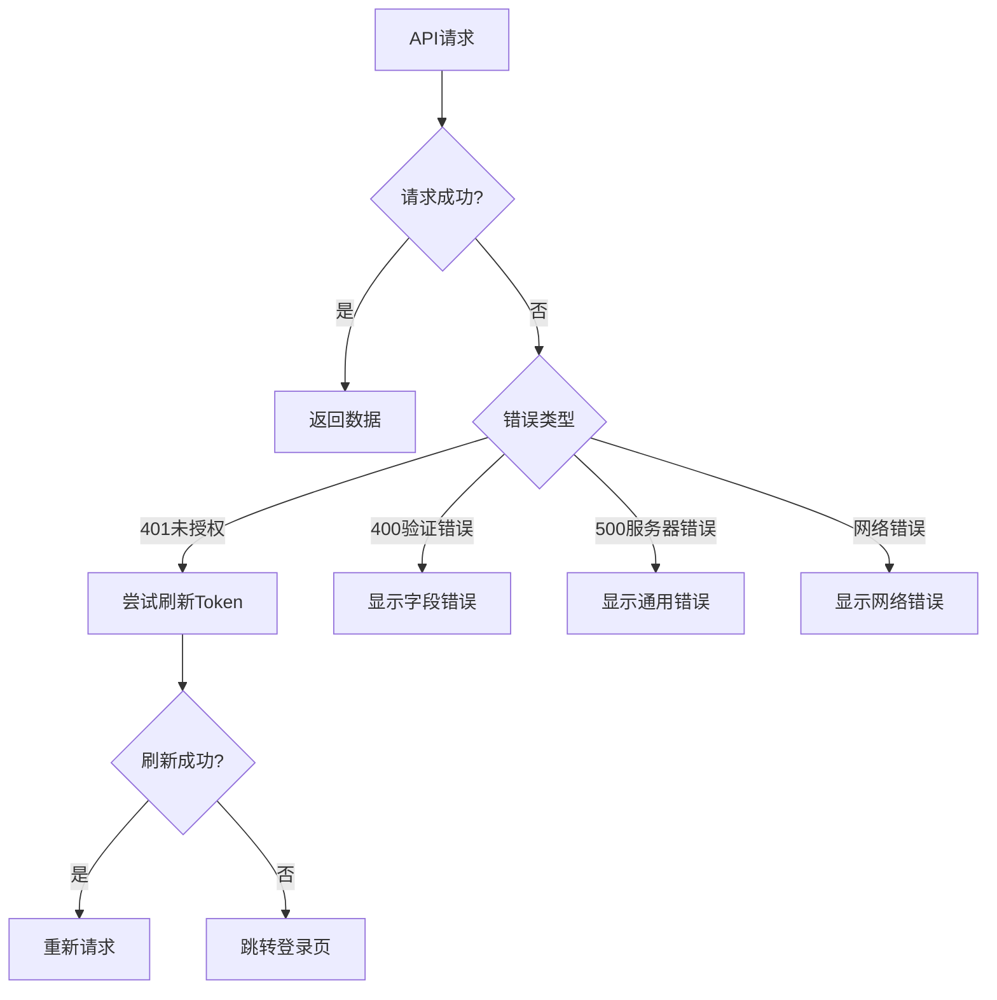

# 用户认证系统设计文档

## 概述

本设计文档描述了SyntaxSeed平台用户认证系统的技术架构和实现方案。该系统基于Vue 3 + TypeScript前端和Express.js + MySQL后端，提供完整的用户注册、登录、验证码验证和会话管理功能。

## 架构

### 整体架构



### 前端架构

- **视图层**: `Login.vue` - 响应式登录/注册界面
- **状态管理**: `userAuth Store` - Pinia状态管理用户信息和认证状态
- **API层**: `userApi.ts` - 封装所有认证相关的API调用
- **HTTP层**: `axios` - 统一的HTTP客户端，包含拦截器和错误处理
- **工具层**: 认证工具、Toast提示、加载状态管理

### 后端架构

- **路由层**: `Auth.js` - 定义认证相关的API端点
- **控制器层**: `authController.js` - 处理业务逻辑
- **中间件层**: `authMiddleware.js` - JWT验证和权限控制
- **服务层**: `emailService.js` - 邮件发送服务
- **数据层**: MySQL数据库存储用户信息

## 组件和接口

### 前端组件设计

#### Login.vue 组件结构

```typescript
interface LoginComponent {
  // 状态管理
  isLogin: Ref<boolean>; // 控制登录/注册模式切换
  loginData: Ref<LoginForm>; // 登录表单数据
  registerData: Ref<RegisterForm>; // 注册表单数据
  captchaData: Ref<CaptchaData>; // 验证码相关数据

  // 表单验证规则
  loginRules: FormRules;
  registerRules: FormRules;

  // 方法
  handleLogin(): Promise<void>;
  handleRegister(): Promise<void>;
  getCaptcha(): Promise<void>;
  sendEmailCode(): Promise<void>;
  toggleMode(): void;
}
```

#### 表单数据接口

```typescript
interface LoginForm {
  email: string;
  password: string;
  captchaCode: string;
  captchaId: string;
  rememberMe: boolean;
}

interface RegisterForm {
  username: string;
  email: string;
  password: string;
  confirmPassword: string;
  emailCode: string;
  captchaCode: string;
  captchaId: string;
  agreeTerms: boolean;
}

interface CaptchaData {
  id: string;
  imageUrl: string;
  loading: boolean;
}
```

### API接口设计

#### 前端API服务

```typescript
class UserApi {
  // 获取图形验证码
  static getCaptcha(): Promise<captchaResponse>;

  // 发送邮箱验证码
  static sendEmailCode(
    email: string,
    captchaCode: string,
    captchaId: string,
  ): Promise<void>;

  // 验证邮箱验证码
  static verifyEmailCode(email: string, code: string): Promise<boolean>;

  // 用户登录
  static login(
    email: string,
    password: string,
    captchaCode: string,
    captchaId: string,
  ): Promise<loginResponse>;

  // 用户注册
  static register(
    username: string,
    password: string,
    email: string,
    emailCode: string,
  ): Promise<registerResponse>;

  // 用户登出
  static logout(): Promise<logoutResponse>;

  // 刷新Token
  static refreshToken(): Promise<refreshApi>;
}
```

#### 后端API端点

```javascript
// 认证路由
GET / api / auth / captcha; // 获取图形验证码
POST / api / auth / send - email - code; // 发送邮箱验证码
POST / api / auth / verify - email - code; // 验证邮箱验证码
POST / api / auth / register; // 用户注册
POST / api / auth / login; // 用户登录
POST / api / auth / logout; // 用户登出
POST / api / auth / refresh - token; // 刷新访问令牌
GET / api / auth / user - info; // 获取用户信息（需认证）
PUT / api / auth / user - info; // 更新用户信息（需认证）
```

## 数据模型

### 用户信息模型

```typescript
interface UserInfo {
  id: string;
  username: string;
  email: string;
  phone?: string;
  avatar?: string;
  createdAt: Date;
  updatedAt: Date;
}
```

### 认证令牌模型

```typescript
interface AuthTokens {
  accessToken: string; // 访问令牌（短期有效）
  refreshToken: string; // 刷新令牌（长期有效）
  expiresIn: number; // 访问令牌过期时间
}
```

### 验证码模型

```typescript
interface CaptchaModel {
  id: string;
  code: string;
  imageData: string;
  expiresAt: Date;
}

interface EmailCodeModel {
  email: string;
  code: string;
  expiresAt: Date;
  verified: boolean;
}
```

## 错误处理

### 错误类型定义

```typescript
enum AuthErrorType {
  INVALID_CREDENTIALS = "INVALID_CREDENTIALS",
  CAPTCHA_EXPIRED = "CAPTCHA_EXPIRED",
  EMAIL_CODE_EXPIRED = "EMAIL_CODE_EXPIRED",
  USER_ALREADY_EXISTS = "USER_ALREADY_EXISTS",
  TOKEN_EXPIRED = "TOKEN_EXPIRED",
  NETWORK_ERROR = "NETWORK_ERROR",
}

interface AuthError {
  type: AuthErrorType;
  message: string;
  field?: string;
}
```

### 错误处理策略

1. **网络错误**: 显示通用网络错误提示，提供重试选项
2. **验证错误**: 在对应表单字段下显示具体错误信息
3. **认证错误**: 自动刷新token或引导用户重新登录
4. **服务器错误**: 显示友好的错误提示，记录详细错误日志

### 错误处理流程



## 测试策略

### 单元测试

1. **组件测试**
   - 表单验证逻辑测试
   - 用户交互事件测试
   - 状态变化测试

2. **API服务测试**
   - HTTP请求参数测试
   - 响应数据处理测试
   - 错误处理测试

3. **状态管理测试**
   - Store状态变更测试
   - 持久化存储测试
   - 计算属性测试

### 集成测试

1. **认证流程测试**
   - 完整登录流程测试
   - 完整注册流程测试
   - Token刷新流程测试

2. **错误场景测试**
   - 网络异常处理测试
   - 服务器错误处理测试
   - 验证码过期处理测试

### 端到端测试

1. **用户场景测试**
   - 新用户注册完整流程
   - 老用户登录完整流程
   - 密码错误重试流程
   - 验证码验证流程

## 安全考虑

### 前端安全

1. **输入验证**: 所有用户输入进行客户端验证
2. **XSS防护**: 使用Vue的内置XSS防护机制
3. **敏感信息**: 避免在前端存储敏感信息
4. **Token管理**: 安全存储和传输认证令牌

### 后端安全

1. **密码加密**: 使用bcrypt加密存储密码
2. **JWT安全**: 使用安全的密钥签名JWT令牌
3. **速率限制**: 对认证接口实施速率限制
4. **输入验证**: 服务端验证所有输入参数

### 通信安全

1. **HTTPS**: 生产环境强制使用HTTPS
2. **CORS**: 配置适当的跨域资源共享策略
3. **请求头**: 设置安全相关的HTTP头部

## 性能优化

### 前端优化

1. **懒加载**: 登录页面按需加载
2. **缓存策略**: 合理缓存用户信息和配置
3. **防抖处理**: 对频繁操作进行防抖处理
4. **图片优化**: 验证码图片压缩和缓存

### 后端优化

1. **数据库优化**: 用户表索引优化
2. **缓存机制**: Redis缓存验证码和会话信息
3. **连接池**: 数据库连接池管理
4. **异步处理**: 邮件发送异步处理

## 部署考虑

### 环境配置

1. **环境变量**: 敏感配置通过环境变量管理
2. **配置分离**: 开发、测试、生产环境配置分离
3. **日志管理**: 结构化日志记录和监控

### 监控和维护

1. **错误监控**: 集成错误监控服务
2. **性能监控**: API响应时间和成功率监控
3. **用户行为**: 登录成功率和失败原因分析
